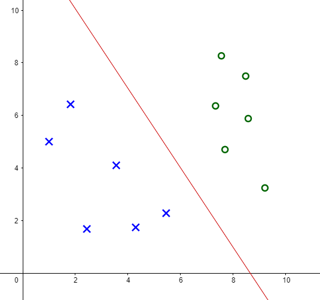
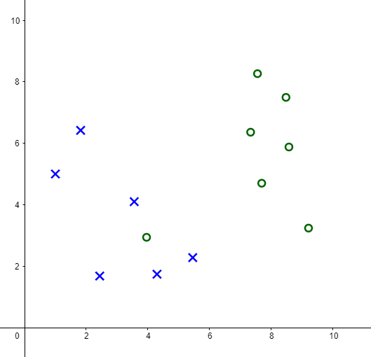
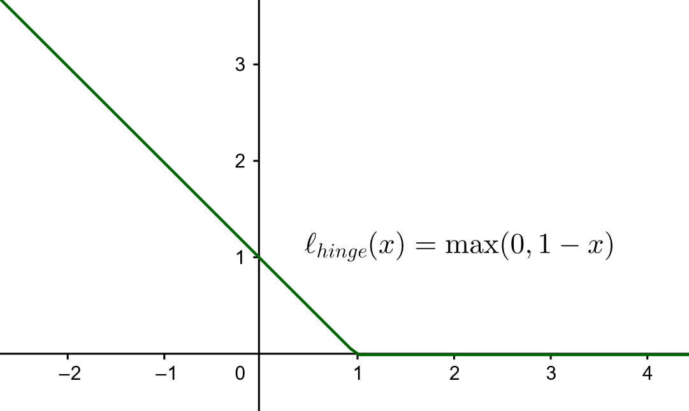

## Motivation

Eine Support Vector Machine (SVM) stellt ein Verfahren zur binären Klassifikation von Daten dar.
Im Feld des Maschinellen Lernens gehören sie dem aktuellen Stand der Technik an
und bieten hohe Klassifikationsgenauigkeit auf einem ähnlichen Niveau wie neuronale Netze.
Aus dem Seminar sind bereits *lineare* Support Vector Machines bekannt.
Dabei wird als Diskriminator eine affine Hyperebene gewählt.
Zur Klassifikation eines Datenpunktes wird nun berechnet,
auf welcher Seite der Hyperebene sich der Punkt befindet
und dementsprechend eine Klasse zugewiesen.

{ width=50% }

Bei Daten, die linear nicht separierbar sind (siehe Abbildung 2),
kann natürlich keine Hyperebene gewählt werden, die alle Daten korrekt in zwei Klassen aufteilt.
Gründe hierfür können beispielsweise \glqq Ausreißer\grqq\ im Datensatz sein.
Abhilfe schafft die Idee, falsche Klassifikation vorhandener Daten zu erlauben (slack variables).

{ width=50% }

Darüber hinaus gibt es Daten, die für Klassifikation durch eine Hyperebene ungeeignet sind.
Ein Beispiel dazu ist in Abbildung 3 gegeben.
Ein linearer Diskriminator führt in diesen Fällen zu einer Vielzahl an Fehlklassifikationen.
Das Konzept der SVM kann jedoch erweitert werden,
um auch für Anwendungen mit Daten dieser Art angewandt zu werden.
Diese Ausarbeitung zielt darauf ab, nicht-lineare SVM zu motivieren
und grundlegende Ideen zu vermitteln.
Dabei werden zunächst wichtige Aspekte linearer SVM wiederholt,
die als Grundlage für die Erweiterung zu nicht-linearen SVM dienen.
Zuletzt wird ein weiterer Zugang zur Konstruktion von SVM beschrieben.

![Ein Datensatz, der nicht sinnvoll von einem linearen Diskriminator klassifiziert werden kann. Ein möglicher anderer Diskriminator ist in schwarz gegeben. Quelle: [2]](../assets/two_moons_nonlinear_separator.png){ width=50% }

## Grundlagen Klassifikation

Ein binäres Klassifikationsproblem lässt sich wie folgt definieren:
Gesucht ist eine Funktion $f: \mathbb{R}^r \to \mathbb{R}$ für den Klassifikator
$C: \mathbb{R}^r \to \{-1,+1\}, x \mapsto \text{signum}(f(x))$,
sodass einem Punkt $x \in \mathbb{R}^r$ eine Klasse ($\pm 1$, positiv oder negativ)zugewiesen wird.
Dazu gegeben sind Lerndaten $\mathcal{L}:=\{(x_i,y_i) \in \mathbb{R}^r \times \{-1,+1\} \mid i=1,\dots,n\}$,
die zur Konstruktion von $f$ verwendet werden können.
$f$ nennt man dabei separierende Funktion,
ihre Nullstellen stellen einen Diskriminator (Entscheidungsgrenze) dar.
Nach der Konstruktion von $f$ wird die Klassifikationsgenauigkeit mit Testdaten (analog Lerndaten) geprüft.
Das Ziel bei der Konstruktion von $f$ ist es,
eine möglichst hohe Klassifikationsgenauigkeit mit den Testdaten zu erreichen,
wobei diese Daten zum Zeitpunkt der Konstruktion nicht verfügbar sind.

## Lineare SVM

Lineare SVMs verwenden als separierende Funktion
$f(x) = \beta_0 + x^T \beta, \beta_0 \in \mathbb{R}, \beta \in \mathbb{R}^r$.
Die Nullstellen von $f$ bilden eine Hyperebene im $\mathbb{R}^r$.

### Linear separierbare Daten

Zunächst nehmen wir den linear separierbaren Fall an (vergleiche Abbildung 1).
$\beta$ und $\beta_0$ werden so gewählt, dass der *margin* maximal ist.
Der *margin* ist die Spanne um die Hyperebene,
in der sich kein Punkt aus den Lerndaten befindet.
Präziser: der *margin* $d$ ist definiert als $d = d_- + d_+$,
wobei $d_-$ der kürzeste Abstand zu einem Punkt aus den Lerndaten der Klasse $-1$ ist
und $d_+$ der kürzeste Abstand zu einem Punkt aus den Lerndaten der Klasse $+1$.
Ist der *margin* maximal und $d_- = d_+$ (die Hyperebene liegt mittig im *margin*),
so spricht man vom *maximal margin classifier*.
Der Margin ist in Abbildung 4 graphisch dargestellt.

![Der *margin* ist die Spanne um die separierende Hyperebene. Quelle: [3]](../assets/margin.png)

Die Punkte aus den Lerndaten, die den Abstand $d_-$ zur Hyperebene haben,
nennt man *support vectors*.
$\beta$ und $\beta_0$ können so skaliert werden,
dass für alle $(x_i,y_i)$ aus den Lerndaten gilt:

$\beta_0 + x_i^T \beta \geq +1 \text{ für } y_i=+1$

$\beta_0 + x_i^T \beta \leq -1 \text{ für } y_i=-1$

Multipliziert man beide Ungleichungen mit $y_i$,
kann man sie in einer ausdrücken:

$y_i (\beta_0 + x_i^T \beta) \geq +1$ (Ungleichung 1)

Für *support vectors* $x_+, x_-$ der positiven respektive negativen Klasse gilt nun:
$\beta_0 + x_+^T \beta = +1$ respektive $\beta_0 + x_-^T \beta = -1$.
Wir interessieren uns nun dafür, aus den *support vectors* den *margin* zu berechnen.
Dazu wird die Differenz $x_+ - x_-$ auf normiertes $\beta$ projiziert:

$d=(x_+ - x_-)^T \dfrac{\beta}{||\beta||} = \dfrac{x_+^T\beta - x_-^T\beta}{||\beta||}
= \dfrac{(1-\beta_0) - (-1-\beta_0)}{||\beta||} =
\dfrac{2}{||\beta||}$

Mit dieser Erkenntnis lässt sich die Suche nach dem *maximum margin* als Maximierungsproblem von $\frac{2}{||\beta||}$ beschreiben.
Das ist äquivalent zum Minimierungsproblem von $||\beta||^2$.
Die Lösung des Optimierungsprobleme soll dabei Ungleichung 1 erfüllen.
Wir erhalten dabei ein konvexes Optimierungsproblem,
das mit der Methode des Lagrange-Multiplikators gelöst werden kann.
Es liefert das optimale $\beta$ als Linearkombination von *support vectors*.

### Linear nicht-separierbare Daten

Das Optimierungsproblem aus dem vorherigen Kapitel ist für linear nicht-separierbare Daten nicht lösbar,
da für mindestens einen Punkt $z$ der Klasse $c_z$ gilt
$c_z (\beta_0 + z^T \beta) < 1$,
was nicht mit der geforderten Nebenbedingung (Ungleichung 1) vereinbar ist.

Zur Lösung dieser Herausforderung wird das Optimierungsproblem um *slack variables* $\xi_i$ erweitert,
die das Verletzen der ursprünglichen Nebenbedingung erlauben.
Diese Verletzungen versucht man natürlich klein zu halten
und nimmt sie daher mit in den Minimierungsauftrag auf.
Somit ergibt sich als neues Minimierungsproblem:

$\min ||\beta||^2 + C\sum \xi_i$ unter den Nebenbedingungen $y_i (\beta_0 + x_i^T \beta) \geq +1 - \xi_i$ und $xi_i \geq 0$

$C$ stellt dabei einen Hyperparameter dar, der den Einfluss der *slack variables* steuert. Großes $C$ führt zu geringeren Verletzungen der Ungleichung 1, kleines $C$ führt zu stärken Verletzungen.
In Abbildung 5 sind *slack variables* veranschaulicht,
insbesondere erkennt man, dass ein größerer *margin* größere *slack variables* bedeutet.

![Veranschaulichung von *slack variables*. Für Punkte außerhalb des *margin* ist die zugehörige *slack variable* gleich null. Quelle: [1]](../assets/slack.png){ width=70% }

Auch im linear nicht-separierbaren Fall lässt sich das Optimierungsproblem mit dem Lagrange-Multiplikator lösen.
Wiederum erhalten wir das optimale $\beta$ als Linearkombination von *support vectors*.

## Nicht-lineare SVM

Wir betrachten von nun an den Fall, dass ein linearer Diskriminator zur Klassifikation ungeeignet ist (vergleiche Abbildung 3).
Nicht-lineare SVM verwenden die Idee des *feature space*.
Dabei werden die zu klassifizierenden Daten (*input space*) durch eine (nicht-lineare) Abbildung
$\Phi: \mathbb{R}^r \to \mathcal{H}$ in den *feature space* $\mathcal{H}$ transformiert.
Nach der Transformation wendet man die Verfahren der linearen SVM im *feature space* an.
Die Klasse eines Punktes bleibt unberührt.
Vorteile dieses Vorgehens sind beispielsweise,
dass man linear nicht-separierbare Daten durch die Transformation separierbar machen kann.
Weiterhin kann man auch in einen hoch- oder sogar unendlich-dimensionalen *feature space* abbilden.
Wendet man diese Transformation auf die Eingabedaten des Klassifikationsproblems an,
so erhält man in der separierenden Funktion und somit im Optimierungsproblem innere Produkte der Form
$\Phi(x_i)^T \Phi(x_j)$,
da die optimale Lösung dieses Optimierungsproblems eine Linearkombination aus *support vectors* ist.
welche man auch allgemeiner als Skalarprodukt schreiben kann:
$\langle \Phi(x_i), \Phi(x_j) \rangle$.
Die Berechnung eines solchen inneren Produktes in einem hochdimensionalen $\mathcal{H}$ ist meist rechenintensiv oder für unendlich-dimensionale $\mathcal{H}$ gar unmöglich.
Der folgende Abschnitt erläutert den Kernel Trick,
der die Idee der Transformation in den *feature space*
mit einfacher Berechenbarkeit kombiniert.

### Kernel Trick

Der Kernel Trick besagt, dass man das Skalarprodukt
$\langle \Phi(x_i), \Phi(x_j) \rangle$
nicht im *feature space* berechnet,
sondern mit einem *Kernel*
$K: \mathbb{R}^r \times \mathbb{R}^r \to \mathbb{R}$
im *input space*,
wobei gelten soll:

$K(x_i,x_j) = \langle \Phi(x_i), \Phi(x_j) \rangle$

Dabei ist es im Allgemeinen nicht möglich,
von einem *Kernel* $K$ auf die zugehörige Transformation $\Phi$ zu schließen
oder andersherum.

### Beispiele für Kernel

Ein einfacher polynomialer *Kernel* ist gegeben durch
$K(x,y) = (x^T y + 1)^2$.
Falls der *input space* 2-dimensional ist,
ist die zugehörige Transformation in den *feature space*
$\Phi(x) = (x_1^2,x_2^2,\sqrt{2}x_1x_2,\sqrt{2}x_1,\sqrt{2}x_2,1)^T$.
Man sieht, dass die ursprünglichen Daten in einen 6-dimensionalen Raum transformiert werden.
Die Verwendung des *Kernels* vereinfacht die Berechnung des Skalarproduktes enorm.

Ein weiterer *Kernel*, der große Popularität hat,
ist die sogenannte *Gaussian radial basis function*:

$K(x,y)=\exp(-\dfrac{||x-y||^2}{2\sigma^2})$

wobei $\sigma>0$ einen Hyperparameter darstellt.

## SVM als Lösung zum Hinge-Loss

Einige Verfahren des Maschinellen Lernens beruhen auf der Minimierung einer *loss*-Funktion.
Dabei werden Fehlklassifikationen der Lerndaten des durch den Klassifikator gewichtet summiert.
Je nach Verfahren bieten sich unterschiedliche *loss*-Funktionen an.
Mit dieser Herangehensweise lassen sich auch SVMs konstruieren.

Dabei kommt der *Hinge-loss* zum Einsatz.
Er ist definiert als $\ell(f(x_i)) = \max(0,1-y_i f(x_i))$,
wobei $f(x_i)$ das Klassifikationsergebnis zu einem Punkt $x_i$
mit wahrer Klasse $y_i \in \{\pm 1\}$ ist.
Der Graph des *Hinge-loss* ist in Abbildung 6 gegeben.
Ist $x_i$ korrekt klassifiziert und $|f(x_i)|\geq 1$,
so beträgt der *loss* null.
Ist $x_i$ korrekt klassifiziert und $|f(x_i)| < 1$,
so nimmt $\ell$ einen Wert zwischen 0 und 1 an.
Dieser Fall entspricht einer Verletzung des *margin*
(vergleiche lineare SVM für linear nicht-separierbare Daten).
Für falsche Klassifikation nimmt $\ell$ Werte größer 1 an.

{ width=50% }

Die Suche nach einer separierenden Funktion lässt sich nun schreiben als Minimierungsproblem:

$\min_f \sum_i \ell(f(x_i) + \lambda ||f||$

wobei der zweite Summand $\lambda ||f||$ als Regularisierung zur Vermeidung von Überanpassung dient.
Die Norm $||f||$ kann je nach Kontext geschickt gewählt werden.
Zur Optimierung werden meist gradienten-basierte Verfahren herangezogen.
Da der *Hinge-loss* nicht überall differenzierbar ist,
verwendet man dort das Konzept der Subgradienten oder
differenzierbare Alternativen als *loss*-Funktion.

Es kann gezeigt werden, dass das obige Minimierungsproblem für SVM äquivalent ist zu

$\min_f \sum_i \ell(f(x_i) + \lambda ||\beta||^2$ mit $f(x) = \beta_0 + \Phi(x)^T \beta$

Diese Darstellung bietet einen weiteren Zugang zu SVM und
andere Möglichkeiten zur Konstruktion von SVM.

## Fazit

SVMs bieten viele Anwendungsmöglichkeiten und stellen ein robustes Werkzeug für Klassifikation dar.
Über die SVM als linearen Diskriminator kann man sie auch nicht-linear einsetzen.
Dafür verwendet man die Idee des *feature space* und des *Kernel Trick*.
SVM sind im Vergleich zu den omnipräsenten künstlichen neuronalen Netzen
sowohl in der Berechnung als auch in der Ausführung Leichtgewichte,
wodurch sie in der Praxis oftmals Vorteile bieten.

## Literatur

1. A.J. Izenman, Modern Multivariate Statistical Techniques, Springer 2008.
2. Gerhard Neumann, Maschinelles Lernen -- Grundverfahren, Vorlesungsfolien 2021.
3. Sarah Schönbrodt, Maschinelle Lernmethoden für Klassifizierungsprobleme, Springer 2019.
4. Patrick Winston, 6.034 Artificial Intelligence, Massachusetts Institute of Technology: MIT OpenCourseWare, <https://ocw.mit.edu> 2010.
