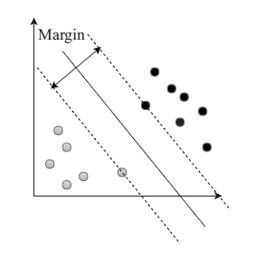
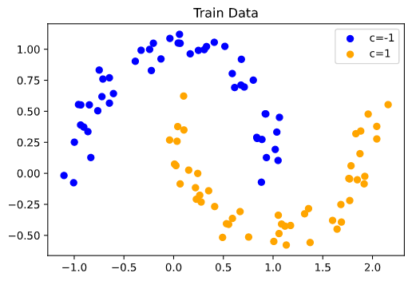
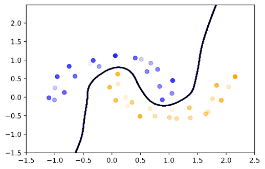
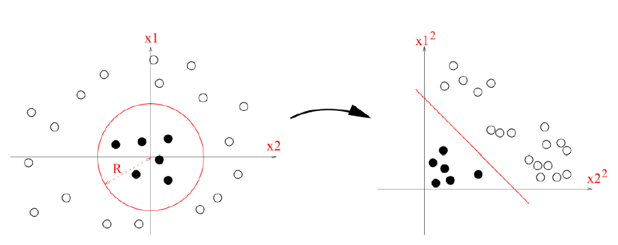

### Überblick

- Wiederholung: Lineare SVM
- *feature space*
- Kernel Trick
- SVM und Gradient descent

## Linear SVM

### Linear Support Vector Machines (SVM)

{ width=50% }

- nutze separierende Funktion $f(x)=\beta_0+x^T\beta$

### Linear SVM -- Margin

- Hyperebene mit maximalen Margin wird gewählt

{ width=50% }

- Minimierungsproblem: $\min ||\beta||^2$ mit $y_i (\beta_0 + x_i^T \beta) \geq +1$

### Linear SVM -- Minimierungsproblem

- Minimierungsproblem: - $\min ||\beta||^2$ mit $y_i (\beta_0 + x_i^T \beta) \geq +1$
- Lösungsverfahren: Lagrange Multipliers
- Wolfe-Dual: $\max_\alpha 1_n^T \alpha - \dfrac{1}{2} \alpha^T H \alpha$ mit Nebenbedingungen $\alpha_i \geq 0, \alpha^T y = 0$

### Linear SVM -- linearly non-separable data

{ width=45% }

- Verletzung des Margin wird erlaubt
- Gleichung wird um slack-Variablen erweitert
- $\min ||\beta||^2 + C\sum_i \xi_i$ mit $y_i (\beta_0 + x_i^T \beta) \geq +1 - \xi$ und $\xi \geq 0$

## Nonlinear SVM

### Linearly non-separable data: Two Moons

<!-- TODO: show two moons / other -->

### Linearly non-separable data -- Goal

<!-- TODO: show two moons / other -->

### Nonlinear SVM -- Basic Idea

- Transformiere Daten zunächst in den *feature space* und wende dort lineare SVM an

### Nonlinear SVM -- *feature space*

- $\Phi: \mathbb{R}^r \to \mathcal{H}$ als nicht-lineare Transformation
- alte Gleichung: $\min ||\beta||^2$ mit $y_i (\beta_0 + x_i^T \beta) \geq +1$
- neue Gleichung: $\min ||\beta||^2$ mit $y_i (\beta_0 + \Phi(x_i)^T \beta) \geq +1$
