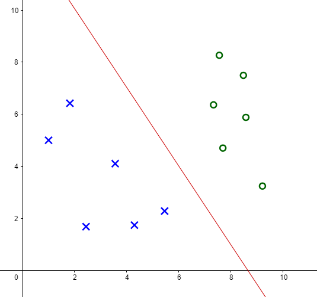
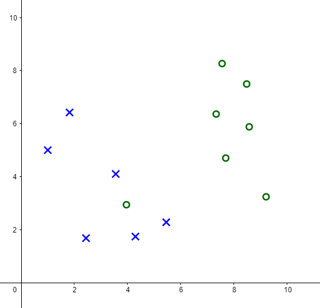
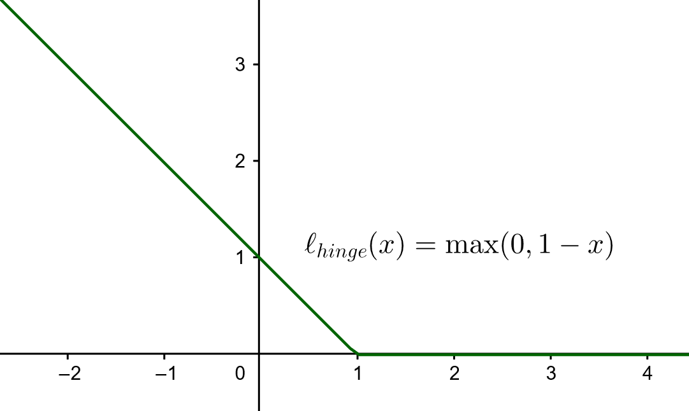

### Überblick

- Wiederholung: Lineare SVM
- *feature space*
- Kernel Trick
- SVM und Gradient descent

## Linear SVM

### Linear Support Vector Machines (SVM)

{ width=50% }

- nutze separierende Funktion $f(x)=\beta_0+x^T\beta$

### Linear SVM -- Margin

- Hyperebene mit maximalen Margin wird gewählt

{ width=50% }

- Minimierungsproblem: $\min ||\beta||^2$ mit $y_i (\beta_0 + x_i^T \beta) \geq +1$

### Linear SVM -- Minimierungsproblem

- Minimierungsproblem: - $\min ||\beta||^2$ mit $y_i (\beta_0 + x_i^T \beta) \geq +1$
- Lösungsverfahren: Lagrange Multipliers
- Wolfe-Dual: $\max_\alpha 1_n^T \alpha - \dfrac{1}{2} \alpha^T H \alpha$ mit Nebenbedingungen $\alpha_i \geq 0, \alpha^T y = 0$
  - $H_{ij}=y_i y_j(x_i^T x_j)$

### Linear SVM -- linearly non-separable data

{ width=45% }

- Verletzung des Margin wird erlaubt
- Gleichung wird um slack-Variablen erweitert
- $\min ||\beta||^2 + C\sum_i \xi_i$ mit $y_i (\beta_0 + x_i^T \beta) \geq +1 - \xi$ und $\xi \geq 0$

## Nonlinear SVM

### Linearly non-separable data: Two Moons

<!-- TODO: show two moons / other -->

### Linearly non-separable data -- Goal

<!-- TODO: show two moons / other -->

### Nonlinear SVM -- Basic Idea

- Transformiere Daten zunächst in den *feature space* und wende dort lineare SVM an

### Nonlinear SVM -- *feature space*

- $\Phi: \mathbb{R}^r \to \mathcal{H}$ als nicht-lineare Transformation
- alte Gleichung: $\min ||\beta||^2$ mit $y_i (\beta_0 + x_i^T \beta) \geq +1$
- neue Gleichung: $\min ||\beta||^2$ mit $y_i (\beta_0 + \Phi(x_i)^T \beta) \geq +1$

### Nonlinear SVM -- optimizing in *feature space*

**Lineare SVM**

- Wolfe-Dual: $\max_\alpha 1_n^T \alpha - \dfrac{1}{2} \alpha^T H \alpha$ mit Nebenbedingungen $\alpha_i \geq 0, \alpha^T y = 0$
  - $H_{ij}=y_i y_j(x_i^T x_j)$

\pause
**Nicht-lineare SVM**

- Wolfe-Dual: $\max_\alpha 1_n^T \alpha - \dfrac{1}{2} \alpha^T H \alpha$ mit Nebenbedingungen $\alpha_i \geq 0, \alpha^T y = 0$
  - $H_{ij}=y_i y_j(\Phi(x_i)^T \Phi(x_j))$

### Nonlinear SVM -- Kernel Trick

- Wolfe-Dual: $\max_\alpha 1_n^T \alpha - \dfrac{1}{2} \alpha^T H \alpha$ mit Nebenbedingungen $\alpha_i \geq 0, \alpha^T y = 0$
  - $H_{ij}=y_i y_j(\Phi(x_i)^T \Phi(x_j))$
\pause
- inneres Produkt $\Phi(x_i)^T \Phi(x_j)$ meist aufwendig zu berechnen
\pause
- Kernel Trick: nicht transformieren und Skalarprodukt, sondern direkt berechnen:
$K(x_i,x_j)=\Phi(x_i)^T \Phi(x_j)$
\pause
- somit: $H_{ij}=y_i y_j K(x_i,x_j)$
\pause
- Fasst man K(x_i,x_j) als Matrix zusammen, so nennt man diese Kernel Matrix

### Beispiele für Kernel

- polynomialer *Kernel*:
$K(x,y) = (x^T y + 1)^2$.
\pause
  - Falls *input space* 2-dim:
$\Phi(x) = (x_1^2,x_2^2,\sqrt{2}x_1x_2,\sqrt{2}x_1,\sqrt{2}x_2,1)^T$
*feature space* also 6-dim
\pause
- Gauß-Kernel: $K(x,y)=\exp(-\dfrac{||x-y||^2}{2\sigma^2})$
  - meist genutzter Kernel

### Implementierung Kernel-basierter SVM

## Hinge-loss

### SVM und Loss-Funktion

- häufiges Schema in ML: Minimierung einer loss-Funktion
- loss: summiere Fehlklassifikationen
\pause
- für SVM bietet sich der Hinge-loss an
  - $\ell(f(x_i)) = \max(0,1-y_i f(x_i))$
  - loss: $\sum_i \ell(f(x_i))$
\pause

{ width=60% }

### Minimierung der Loss-Funktion

- meist genutzt: Gradient descent (Gradientenverfahren)
- $\beta_{k+1} = \beta_k + \eta g$
  - mit $\eta$ als Schrittweite und Abstiegsrichtung $g$
\pause
- Hinge-loss nicht differenzierbar, daher werden Subgradienten verwendet.

### Konstruktion der SVM mit Hinge-Loss

- Ziel: minimiere $\lambda ||\beta||^2 + \sum_i \ell(f(x_i))$
  - $\lambda$ ist Regularisierungsparameter (Hyperparameter)
\pause
- Minimum nähern mit Gradientenverfahren

### Implementierung Hinge-Loss
